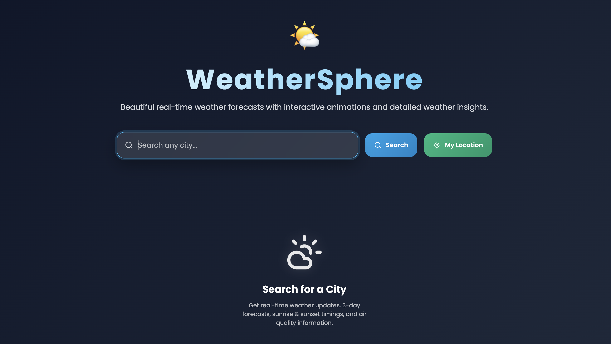
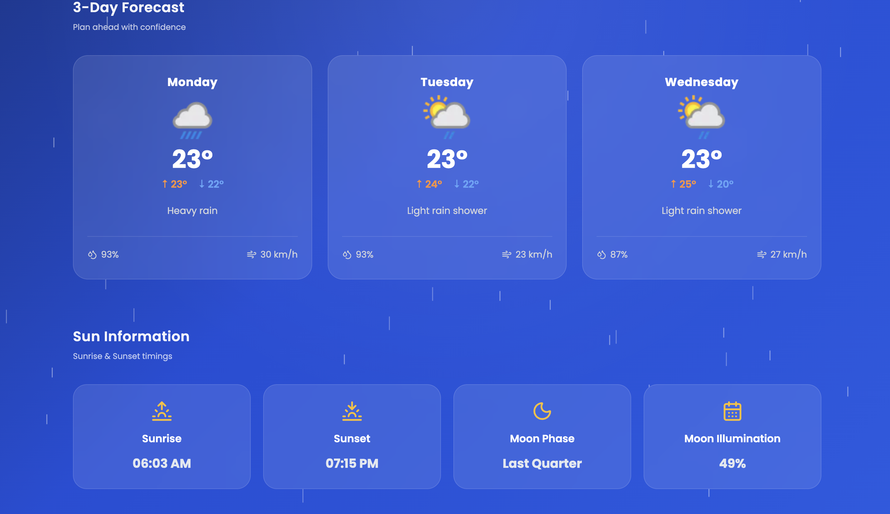
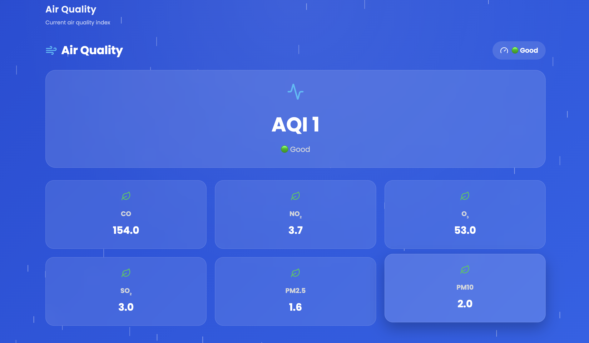
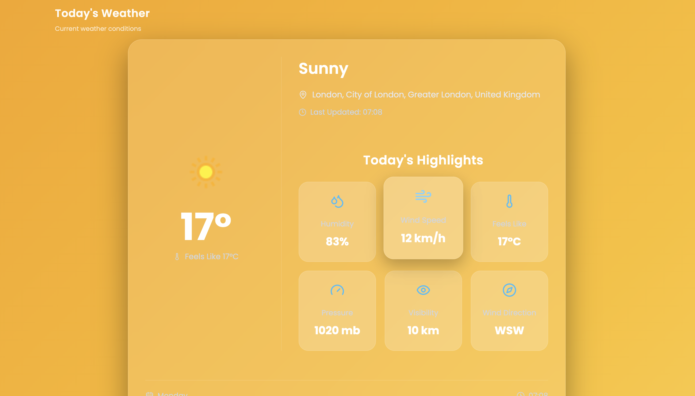

# 🌦️ WeatherSphere

A modern and responsive weather application built with React that provides real-time weather information, 3-day forecasts, geolocation support, and beautiful weather-based animations.

## 🚀 Live Demo

🔗 https://weathersphere-app.vercel.app

---

## ✨ Features

- 🌍 Search weather by city
- 📍 Detect current location
- 🌤 Real-time weather information
- 📅 3-Day Weather Forecast
- 🌅 Sunrise & Sunset timings
- 💨 Wind Speed
- 💧 Humidity
- 🌡 Feels Like Temperature
- 👁 Visibility
- 🎨 Dynamic Weather Animations
- 📱 Fully Responsive Design

---

## 🛠 Tech Stack

- React
- Vite
- JavaScript
- CSS3
- OpenWeather API
- HTML5

---

## 📂 Project Structure

src/
├── components/
├── styles/
├── services/
├── assets/
└── App.jsx

---

## ⚙️ Installation

```bash
git clone https://github.com/Krishnapandey-07/WeatherSphere.git

cd WeatherSphere

npm install

npm run dev
```

---

## 📸 Preview

## 📸 Screenshots

### 🏠 Home Screen



### 🌤️ Weather Details




### 🔍 Search Another City




---

## 🔮 Future Improvements

- 7-Day Forecast
- Hourly Forecast
- Air Quality Index
- Dark / Light Mode
- Weather Maps
- Favorite Cities

---

## 👨‍💻 Developer

Krishna Pandey

B.Tech CSE (AI)
Vedam School of Technology

GitHub:
https://github.com/Krishnapandey-07